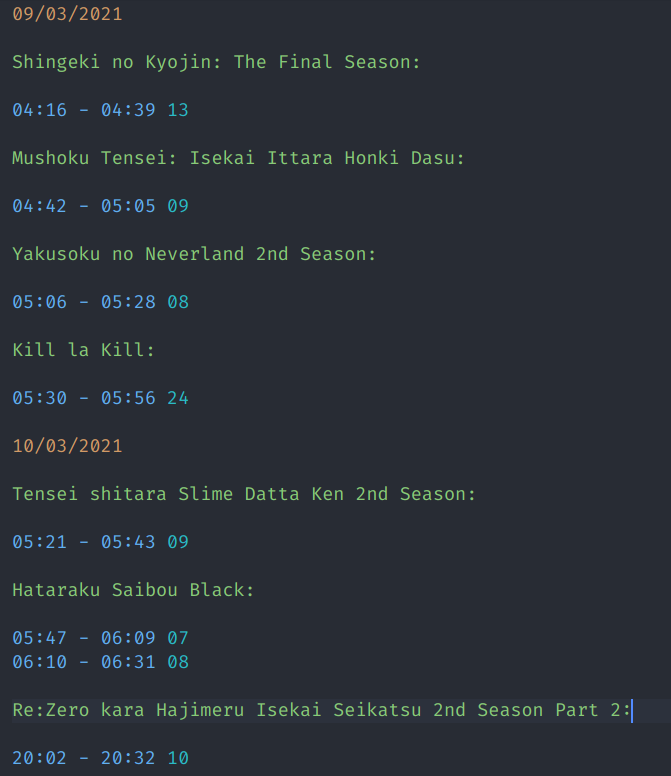

# Marucs' Anime VSCode Extension

A personal project used to facilitate my daily task of registering when I watched certain anime episode in a plain-text list.
## Features

This extension provides syntax highlighting, syntax checking, field autocompletion and keybinds based on ANL rules and features. 

### Syntax Highlighting

Here is a simple example:
## TODO: change image size and include friend example

Dates are in orange, anime titles in green, watch times in blue, episodes in cyan and friends in yellow.

### WIP: autocompletion

### Keybinds

`Alt + D` - inserts current date (dd/mm/yyyy) below the cursor
`Alt + T` - inserts current time (mm:ss) below the cursor
`Alt + N` - inserts current anime's next episode (last episode + 1)

# WIP README

## Requirements

If you have any requirements or dependencies, add a section describing those and how to install and configure them.

## Extension Settings

Include if your extension adds any VS Code settings through the `contributes.configuration` extension point.

For example:

This extension contributes the following settings:

* `myExtension.enable`: enable/disable this extension
* `myExtension.thing`: set to `blah` to do something

## Known Issues

Calling out known issues can help limit users opening duplicate issues against your extension.

## Release Notes

Users appreciate release notes as you update your extension.

### 1.0.0

Initial release of ...

### 1.0.1

Fixed issue #.

### 1.1.0

Added features X, Y, and Z.

-----------------------------------------------------------------------------------------------------------
## Following extension guidelines

Ensure that you've read through the extensions guidelines and follow the best practices for creating your extension.

* [Extension Guidelines](https://code.visualstudio.com/api/references/extension-guidelines)

## Working with Markdown

**Note:** You can author your README using Visual Studio Code.  Here are some useful editor keyboard shortcuts:

* Split the editor (`Cmd+\` on macOS or `Ctrl+\` on Windows and Linux)
* Toggle preview (`Shift+CMD+V` on macOS or `Shift+Ctrl+V` on Windows and Linux)
* Press `Ctrl+Space` (Windows, Linux) or `Cmd+Space` (macOS) to see a list of Markdown snippets

### For more information

* [Visual Studio Code's Markdown Support](http://code.visualstudio.com/docs/languages/markdown)
* [Markdown Syntax Reference](https://help.github.com/articles/markdown-basics/)

**Enjoy!**
